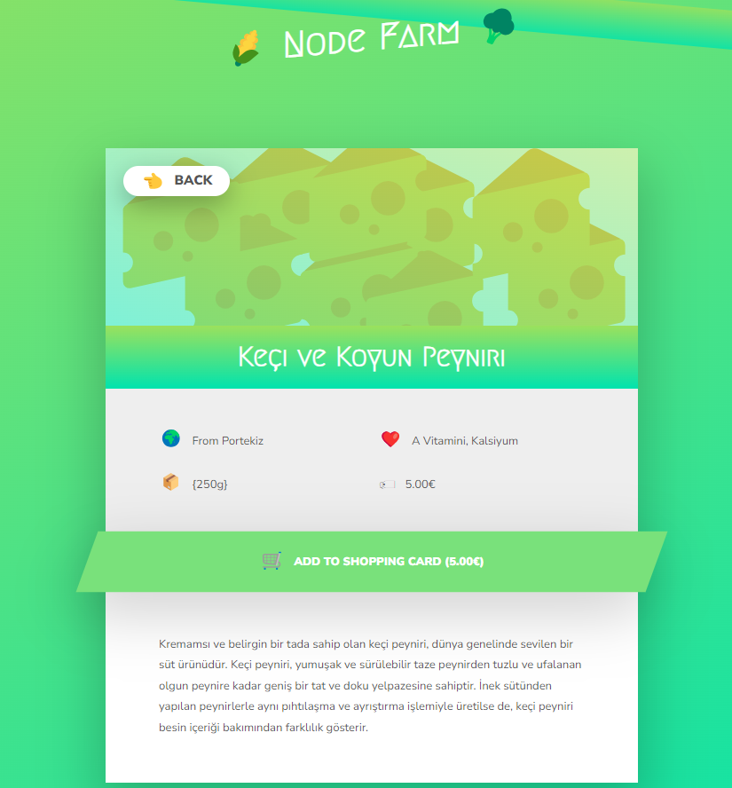

# HTML RENDERING BACKEND

-In this project, I simply displayed the HTML card structures on the screen using the backend. Although this technology may not be used, it is important as an example.

# Images

